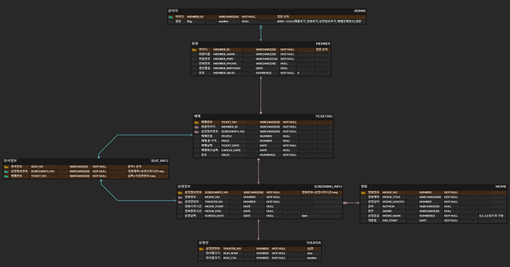
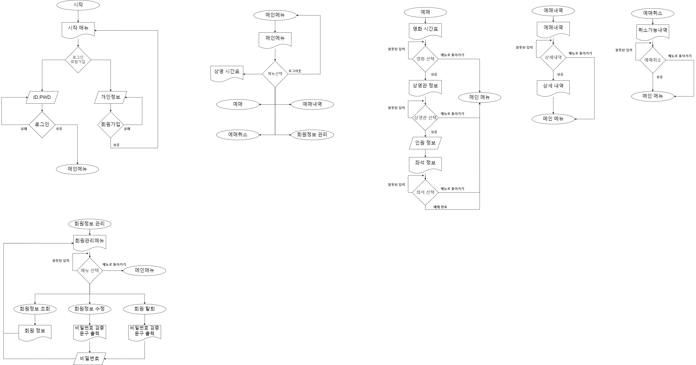

# 콘솔기반 자바 영화 예매 시스템(언럭키 박스오피스)

### 구현한 기능

* 예매
    * 예매기능
    * 예매내역
    * 예매취소
* 회원
    * 회원가입
    * 로그인/로그아웃
    * 회원관리(조회,수정,삭제)

### 팀원 역할

* 송기석: git관리, 회원관리(조회,수정,삭제), admin(영화추가)
* 박광우: 회원가입, 로그인, admin(매출조회)
* 이영서: 예매(예매내역, 예매취소), admin(예매내역, 예매취소)
* 진승현: git관리, 예매(예매기능), admin(상영정보 추가,관리자 권한 구분)

### ERD

### FLOWCHART

